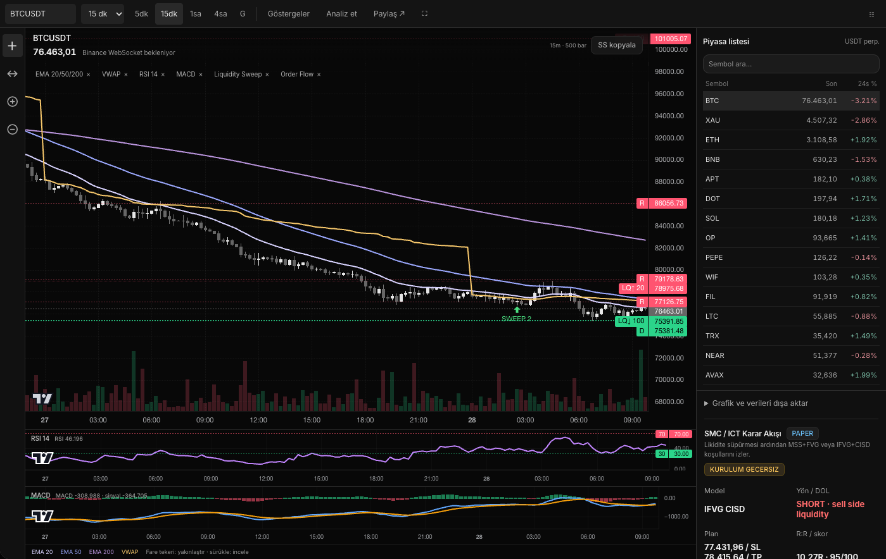

# VORTEX

A self-hosted, real-time cryptocurrency market-analysis and research terminal.
Python/FastAPI backend, SQLite storage, and framework-free JavaScript frontend.

**Early research snapshot based on 5.0.0-rc11.**
Maintained by [krctaha](https://github.com/krctaha).
Source: [github.com/krctaha/vortex](https://github.com/krctaha/vortex).
Project code is available under the MIT license; third-party assets retain their
own licenses. This is an experimental project, not an independently audited product.



*Local synthetic-data preview; not live market prices, a real account, or evidence
of trading performance. The interface currently uses Turkish labels.*

## What it does

- Shares exchange WebSocket market data across connected browser sessions.
- Scans a liquidity-ranked universe of up to 200 distinct USDT perpetual crypto
  markets, with per-candle caching to avoid redundant strategy calculations.
- Uses 4-hour context and closed 15-minute candles for SMC/ICT-inspired structure,
  liquidity sweeps, market-structure shifts, FVG/IFVG, order-block context and plans.
- Ranks research setups with an explanatory quality score and bounded outcome
  feedback. **The score is not a calibrated probability of winning.**
- Tracks paper setups and their entry/TP/SL lifecycle; paper results are not fills.
- Displays live market/RSI panels, BTC price/order-book data, charts and indicators.
- Provides optional Telegram notifications with deduplication and rate controls.
- Provides authenticated access and administrator-only account management.

The chart workspace has a compact toolbar, a large chart, indicator panes and a
market sidebar. It uses TradingView Lightweight Charts; it is not TradingView,
and does not replicate its complete drawing, alert or replay functionality.

## Safety and limitations

Run **`run_smc.py` only** for this research snapshot. It does not start the legacy
execution workers, and blocks write requests under `/api/trading`. Legacy order
modules remain in the tree for compatibility and tests; do not expose a different
entrypoint to turn this project into a live execution service.

There is no profit guarantee. Signals, scores, simulated outcomes and technical
patterns are research information, not financial advice. Costs, slippage, funding,
latency, intrabar ambiguity and exchange restrictions can materially change results.
WebSocket prices are event-driven; strategy rescans run on closed candles rather
than on every tick. News, macro data and other REST sources refresh on their own
schedules. **Sub-second delivery for every datum is not guaranteed.**

## Local setup

Tested with Python 3.12. Exchange API credentials are not required for public data.
Live mode requires access to Binance public endpoints from an eligible region;
an API key does not bypass geographical access restrictions.

```sh
python3.12 -m venv .venv
source .venv/bin/activate
python -m pip install --upgrade pip
python -m pip install -r requirements-dev.txt
cp .env.example .env
python -c "import secrets; print(secrets.token_urlsafe(48))"
```

Put the generated value into `VORTEX_SECRET_KEY` in your local `.env`, then:

```sh
python run_smc.py
```

Visit `http://127.0.0.1:8000/kurulum` to create the first administrator. Subsequent
logins use `/giris`. Keep `.env` and `data/` private. For synthetic development data,
set `VORTEX_DATA_MODE=demo`; never present demo prices as live prices.

## Tests

```sh
python -m pytest -q
python scripts/check_release.py
```

The original rc11 Python suite passed **322 tests** on 28 September 2026.
The separate publication staging copy also passed all 322 tests after updating
its web dependencies. These updates have not been deployed to the live system.
This count is a snapshot, not a claim of a complete security audit or trading edge.
Tests cover strategy structure, bar handling, stale-data behavior, scoring,
paper tracking, notifications and account authorization. See `docs/TESTING.md`.

## Project map

```text
app/api/          HTTP endpoints
app/services/     shared feeds, scanner, analysis, paper journal, notifications
app/indicators/   indicator calculations
templates/        server-rendered pages
static/           styles, browser code, vendored chart/font assets
testler/          Python and browser regression tests
docs/             architecture, testing and deployment guidance
licenses/         bundled third-party license texts
```

See [architecture](docs/ARCHITECTURE.md), [contributing](CONTRIBUTING.md),
[security](SECURITY.md), and [third-party notices](THIRD_PARTY_NOTICES.md).
This is an early-stage project. Adoption, trading profitability and an independent
security audit are not claimed. Bug reports and focused contributions are welcome.

## License

Maintainer-owned project code is released under the [MIT License](LICENSE).
Third-party components retain their own licenses and notices; see
[third-party notices](THIRD_PARTY_NOTICES.md). No license to a third-party
trademark, feed content or proprietary trading-community indicator is implied.
VORTEX is not affiliated with OpenAI, TradingView, Binance or any trading community.
